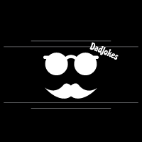
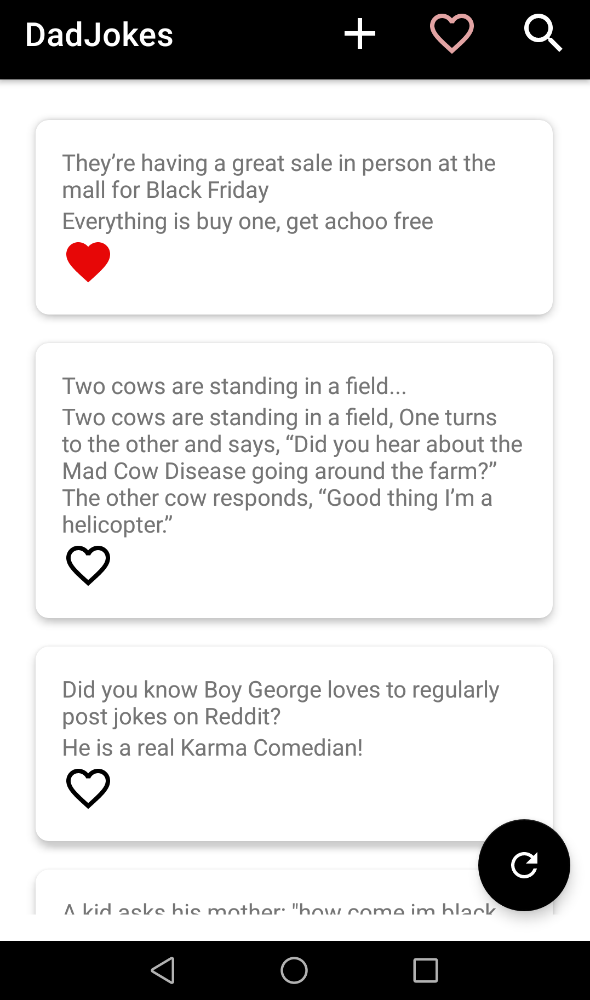
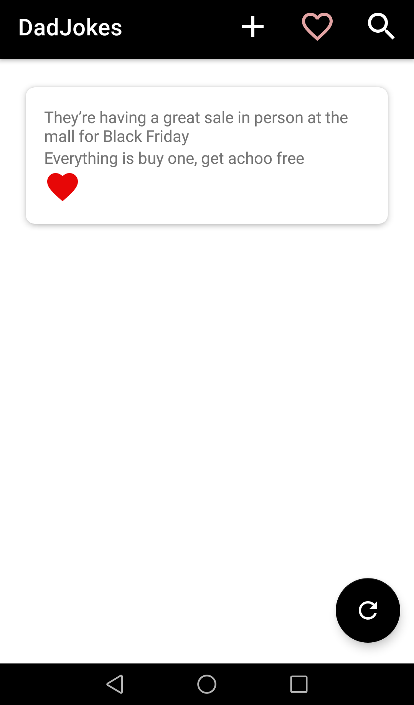
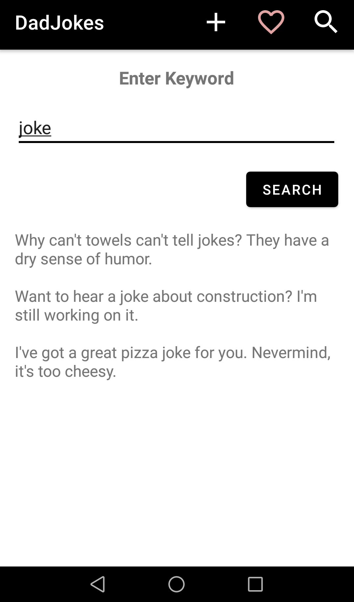
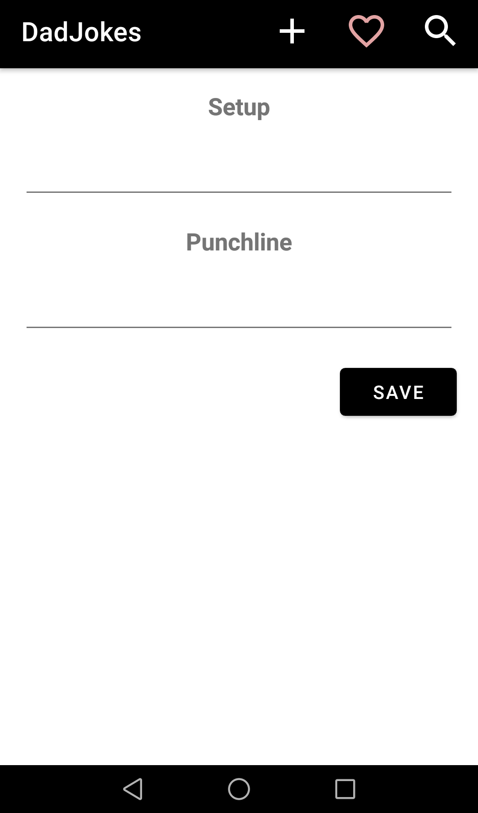

<!-- Improved compatibility of back to top link: See: https://github.com/othneildrew/Best-README-Template/pull/73 -->

<!--
*** Thanks for checking out the Best-README-Template. If you have a suggestion
*** that would make this better, please fork the repo and create a pull request
*** or simply open an issue with the tag "enhancement".
*** Don't forget to give the project a star!
*** Thanks again! Now go create something AMAZING! :D
-->

<!-- PROJECT LOGO -->
 

  

<h3 align="center">DadJokes</h3>

  

  <h4>The jokes you all hate</h4>
  An android app that provides the so-called "DadJokes": unoriginal and predictable joke, especially a pun, the kind supposedly told by fathers. The app provides save and search features for tens of thousands of jokes.
     
    <a href="https://github.com/github_username/repo_name"><strong>Explore the docs »</strong></a>
     
     
    <a href="https://github.com/github_username/repo_name">View Demo</a>
    ·
    <a href="https://github.com/github_username/repo_name/issues">Report Bug</a>
    ·
    <a href="https://github.com/github_username/repo_name/issues">Request Feature</a>
  

<!-- TABLE OF CONTENTS -->

  
Table of Contents

  <ol>
    <li>
      <a href="#about-the-project">About The Project</a>
      <ul>
        <li><a href="#built-with">Built With</a></li>
      </ul>
    </li>
    </li>
    <li><a href="#The app consist of 4 pages:">Overview</a></li>
    <li><a href="#Main Features">Main Features</a></li>
    <li><a href="#contributing">Contributing</a></li>
    <li><a href="#contact">Contact</a></li>
  </ol>

<!-- ABOUT THE PROJECT -->
## About The Project
This is a simple university project with the goal of implementing features of: api calls, MVVM code architecture, saving data in local databes, Kotlin language basics. 

(<a href="#readme-top">back to top</a>)

### Built With

* Kotlin
* Android Studio

(<a href="#readme-top">back to top</a>)

<!-- USAGE EXAMPLES -->
## The app consist of 4 pages:

### MainPage: 
Here a list of jokes is randomly generate, by tapping on the fab button a new list of jokes appears,
 

    

### Favourites: 
Here a list of jokes choosen by the user to store
 

    

### Search: 
Here is possibile to find jokes by searching a keyword
 

    

### Add: 
Here is possibile to add a custom joke to the favourites
 

    

(<a href="#readme-top">back to top</a>)

<!-- ROADMAP -->
## Main Features

- [X] Calls to public APIs
- [X] Factorized code to follow the guidelines of the MVVM architecture
- [X] Data management in local databases
   

(<a href="#readme-top">back to top</a>)

<!-- CONTRIBUTING -->
## Contributing

If you have a suggestion that would make this better, please fork the repo and create a pull request. You can also simply open an issue with the tag "enhancement".
Don't forget to give the project a star! Thanks again!

1. Fork the Project
2. Create your Feature Branch (`git checkout -b feature/AmazingFeature`)
3. Commit your Changes (`git commit -m 'Add some AmazingFeature'`)
4. Push to the Branch (`git push origin feature/AmazingFeature`)
5. Open a Pull Request

(<a href="#readme-top">back to top</a>)

<!-- CONTACT -->
## Contact

Massimiliano Battelli - massimilian.battelli@studio.unibo.it

Project Link: [https://github.com/MassimilianoBattelli/Dadjokes](https://github.com/MassimilianoBattelli/Dadjokes)

(<a href="#readme-top">back to top</a>)

<!-- MARKDOWN LINKS & IMAGES -->
<!-- https://www.markdownguide.org/basic-syntax/#reference-style-links -->

