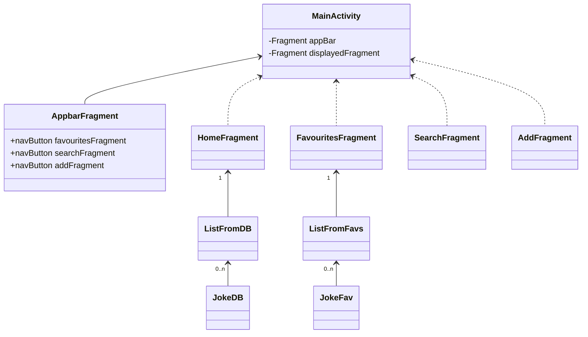
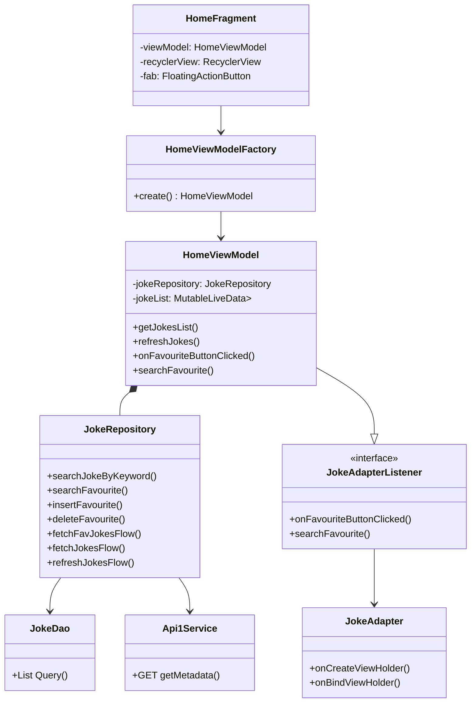
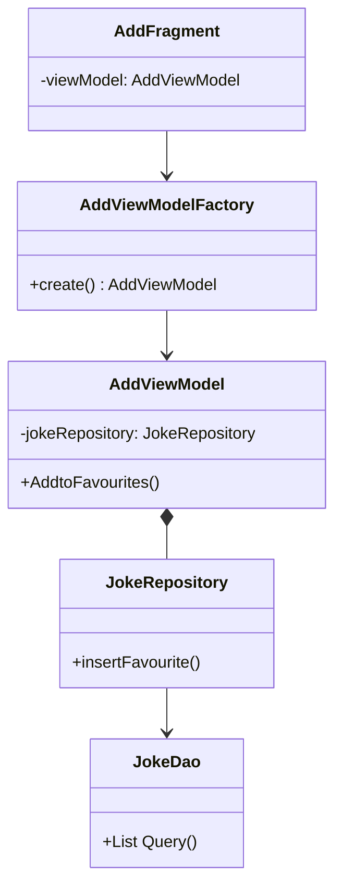
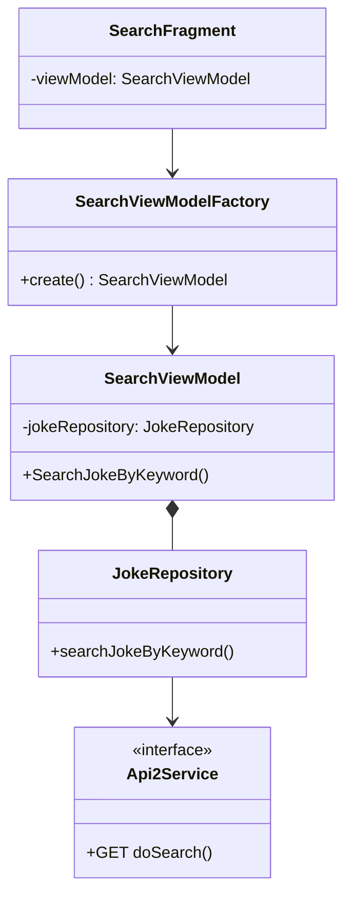

# Relazione Progetto per Esame Laboratorio di Programmazione di Sistemi Mobili

### Abstract

L'app ha lo scopo di fornire un enorme quantità di battute predefinite all'utente il quale può leggerne quante ne vuole,  salvarne di preferite, aggiungerne di sue per non rischiare di dimenticarle,
e anche di cercarne in base a delle parole chiave.

#### Requisiti funzionali

-   L'app mostra una lista di battute all'utente, il quale può refresharne il contenuto a piacimento.
-   Ogni battuta della lista può venire cliccata per essere aggiunta a quella dei preferiti.
-   Una pagina permette di cercarne dal database principale tramite una parola chiave.
-   E' possibile aggiungere alle preferite di personalizzate tramite un form.

#### Requisiti non funzionali, possibili feature future

-   Invio di una battuta giornaliera con annessa notifica.
-   Possibilità di condividerle tramite i canali di comunicazione.

### Analisi e modello del Dominio

Il modello è formato da una activity principale che contiente tutto l'applicativo e la navigazione tra le pagine è stata fatta tramite il funzionamento dei fragment. La MainActivity contente un Appbarfragment che costituisce la barra delle applicazioni situata nella parte sopra dello schermo, da cui è possibile navigare tra le pagine. All'avvio apparirà il fragment della pagina principale 'HomeFragment', tramite l'Appbar è possibile navigare sostituiendo il fragment corrente con un altro.
L'HomeFragment contiene la lista delle battute generate dall'Api e automaticamente salvate nel database locale.
Il FavouritesFragment contiene la lista delle battute salvate nel database dei preferiti.
SearchFragment contiene il form a cui è possibile cercare delle battute tramite una parola chiave.
AddFragment contiente il form per aggiungere una battuta propria al database dei preferiti.

Gli elementi costitutivi del dominio sono sintetizzati nella seguente figura.

Nel caso si voglia aggiungere altre funzionalità basterà aggiungere un fragment e implementare le logiche di businness e layout.

# Design
Per l'architettura software è stato usato il pattern MVVM (Model-View-ViewModel) utilizzato per separare la logica di presentazione (UI) dalla logica di business e dai dati sottostanti. Questo pattern promuove una migliore organizzazione del codice, una maggiore testabilità e una maggiore scalabilità delle applicazioni.

Model: rappresenta la logica di business e i dati sottostanti dell'applicazione. Ovvero le classi per le chiamate API, e interazione dei Database.

View: rappresenta l'interfaccia utente (UI) dell'applicazione. Questo include le varie schermate dell'app come la schermata principale, la schermata dei preferiti, la schermata di ricerca, ecc. La View si occupa principalmente di mostrare i dati forniti dal ViewModel e di gestire le interazioni dell'utente.

ViewModel: agisce come intermediario tra la View e il Model. È responsabile di fornire i dati necessari alla View e di gestire le azioni dell'utente. Il ViewModel contiene la logica di presentazione che consente di preparare i dati da visualizzare nella View e di gestire le interazioni dell'utente come i clic sui pulsanti o le modifiche degli input dell'utente. Inoltre, il ViewModel può avere una connessione con il Model per recuperare o salvare i dati necessari.

## Design dettagliato

### HomeFragment e FavouritesFragment

I fragment riguardanto l'Homepage e la Favouritespage presentano la stessa architettura di codice, nello schema UML seguente si mostra solo quella della Home per sintetizzare:

Il fragment contiene riferimenti alla recyclerView e al Fab button, utilizzando la classe HomeViewModelFactory crea un istanza del HomeViewModel che gestirà la logica di passaggio dei dati.
Il ViewModel implementa l'interfaccia JokeAdapterListener che definisce dei metodi per interagire con la recyclerView. Il JokeAdapter definisce la vista degli elementi della lista.
Il ViewModel inoltre è responsabile di interagire con il JokeRepository che funge da intermediario tra la sorgente dei dati (database locale, e le API remote) e il resto dell'applicazione. Esso fornisce un'interfaccia comune per accedere e manipolare i dati, senza che il resto dell'applicazione debba conoscere i dettagli specifici di come i dati sono ottenuti e memorizzati.
Il Repository utilizza l'interfaccia Dao per fare le query al database room locale, e l'interfaccia Api1Service per fare le chiamate all'API tramite le librerie retrofi e moshi.

### AddFragment

L'AddFragment si riferisce alla pagina di aggiunto di una battuta dall'utente alla liste delle preferite:

Simile all'architettura precedente, in questo caso la funzione del Repository deve solamente interagire con il database locale per inserite la battuta.

### SearchFragment 

Questo fragment è riferito alla pagina di ricerca delle battute tramite una parola chave.
La struttura è molto similie a quella dell'AddFragment, unica differenzia sostanziale è che il Repository invece che comunicare con il database locale deve fare una query di ricerca alla seconda
Api del progetto, tramite l'interfaccia Api2Service.

# Sviluppo

## Note di sviluppo

# Commenti finali

## Autovalutazione e lavori futuri

